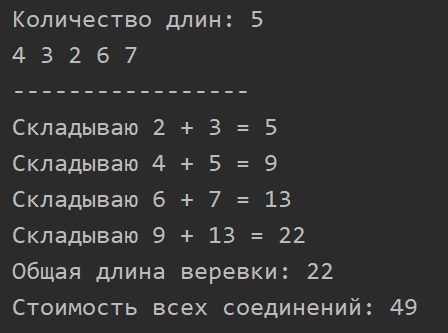

Воронов Вадим ИБ-119
# Лабораторная работа 4.
## Соединение n веревок разной длины. Цена соединений должна быть минимальной.
Чтобы цена соединения была минимальной, нужно каждый раз складывать минимальные элементы.
### Класс CustomMinPQueue
Для реализации решения данной задачи я использовал немного измененную версию двоичной очереди MinPQueue.
Добавлены два новых метода:
 * публичный sumLeastElements()
 * приватный sumElements()

Метод sumLeastElements() складывает два минимальных числа в очереди. По умолчанию эти числа хранятся под индексами 1 и 2 массива (a и b соответственно), но, так как дочерние элементы не всегда упорядочены друг с другом, пришлось добавить дополнительную проверку:
```java
if (n > 2 && greater(b, b+1))
        b++;
```
После сложения этих чисел результат записывается в массив под индексом дочернего элемента (2 или 3), а первый элемент удаляется из очереди.
Метод sumLeastElements() возвращает цену, затраченную на сложение, или 0, если в очереди остался лишь один элемент.

### Класс RopeLength
Класс RopeLength представляет собой небольшой клиент для тестирования.

### Образец вывода программы

